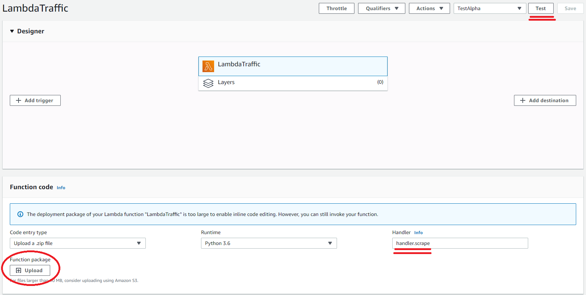
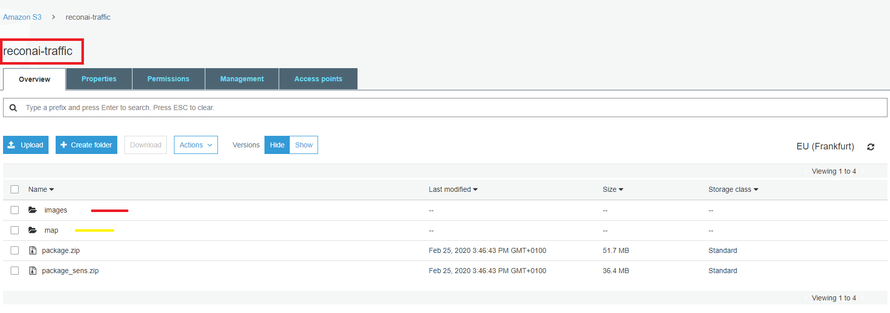
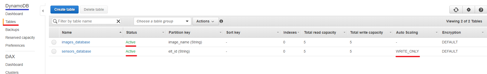
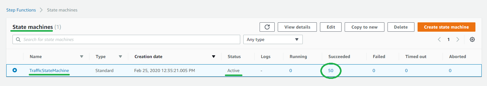
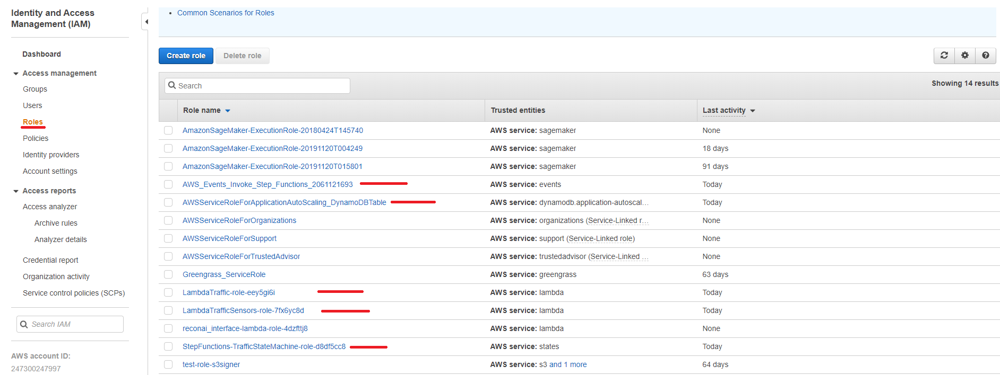

# AM-Traffic-Phase2.Iteration2_Task-4
Crawler

In this task I have made a crawler on AWS using Lambda function , S3 , DynamoDB and CloudWatcher package.zip can be found in AWS S3 bucket 'reconai-traffic' : contains the dependencies and scripts to run lambda function map : can be found in the map directory in AWS S3 bucket 'reconai-traffic'

**image_name** : 'camera id'_ r'road_condition'_ w'weather_condition'_ 'measuredTime'

UPDATE: 25/02/2020

Added the handler (sensors_handler.py) of 'LambdaTrafficSensors' lambda function that loads sensors_database.csv from S3 bucket 'reconai-traffic' to save sensors data in DynamoDB table.

# Deployment
## Scripts description
* **data_processing.py**: contains TrafficCrawler class responsible for extracting main information from json files in order to build images and sensors databases and to create Finland map that contains camera and weather stations.
* **utils.py**: contains helper functions used by *data_processing.py*.
* **handler.py**:  contains the handler (*scrape* function) of the lambda function **'LambdaTraffic'**:
  * First, json files are downloaded from the traffic website to s3 bucket **'reconai-traffic'**. 
  * Then, from these files informations are extracted: 
  	* dataframe of the camera stations images,
  	* and dataframe of the data of sensors corresponding to the weather stations located nearby the camera stations.
  * Once informations are extracted, the images are downloaded in the directory *'images'* in **'reconai-traffic'** bucket and json files are deleted.
  * Finally the images database is saved in DynamoDB table **'images_database'**, 
  and the sensors data is saved as a csv file in 'reconai-traffic' bucket in order to be used by another lambda function **'LambdaTrafficSensors'**.
 * **sensors_handler.py**: contains the handler (*handler* function) of the lambda function **'LambdaTrafficSensors'**:
	it loads the csv file of sensors data generated by **'LambdaTraffic'** lambda function and dumps it in 'sensors_database' DynamoDB table. Once items are added, the csv file is deleted from "reconai-traffic" s3 bucket.
* **map.py**: script to build and save the map that contains camera and weather stations.
## Note
Pease note that 'Europe (Francfort) eu-central1' should be selected as region.
## Lambda function
**On Local machine**: create package that contains scripts + used python libraries that are installed and packed as follows:

```sh
pip install package – t .
chmod -R 755 .
zip -r ../package.zip .
```
**PS**: Use Python 3.6 or similar version.

**On AWS console**: Upload the zip directly on Lambda console or on S3 bucket. Once uploaded, just save and be sure to check on the handler. Then, just run a test.

**In IAM console manager**: Add required policies to the corresponding roles .
<p align="center">
  
</p>

## S3 Bucket
**On AWS console**: Just create a new S3 Bucket that will contain all the downloaded images and where you can also load the lambda package.zip

**In IAM console manager**: Add required policies to the corresponding roles.
<p align="center">
  
</p>

## DynamoDB
**On AWS console**: Create tables in the DynamoDB that will contain your Images data and Sensors data.

**In IAM console manager**: Add required policies to the corresponding roles.
<p align="center">
  
</p>

## Step Function
**On AWS console**: Once you create a State Machine, adjust the workflow 
(eg. Start -> Lambda1 -> Lambda2 -> End)<br/>
Adjust the CloudWatch Cron in order to make the State Machine trigger in specific time.<br/>
*PS*: Timer set on GMT.

**In IAM console manager**: Add required policies to the corresponding roles.
<p align="center">
  
</p>

## IAM (role manager):
**In IAM console manager**: Add required policies to the corresponding roles .
<p align="center">
  
</p>
The added policies are:

* For Lambda functions (both lambda functions):
	* **AmazonS3FullAccess**: to enable the lambda function to umpload files and delete files in S3 bucket.
	* **AmazonDynamoDBFullAccess**: to enable the use of DynamoDB by the lambda function for writing data.

* For Step Functions:
	* **AmazonLambdaFullAccess**: to enable the use of Lambda functions by the Step function.
* For DynamoDB:
	* **AwsApplicationAutoscalingDynamoDBTablePolicy**:  to enable the use of the Autoscaling policy for our DynamoDB table (in our case 'sensors_database' table needs 'WRITE_ONLY' Autoscaling policy).

* For CloudWatch (Invoke Step Functions):
	* **AwsLambdaFullAcess**: to enable the crone on the Lambda functions.
	* **AwsStepfunctionFullAccess**: to enable the crone on the Step function.
